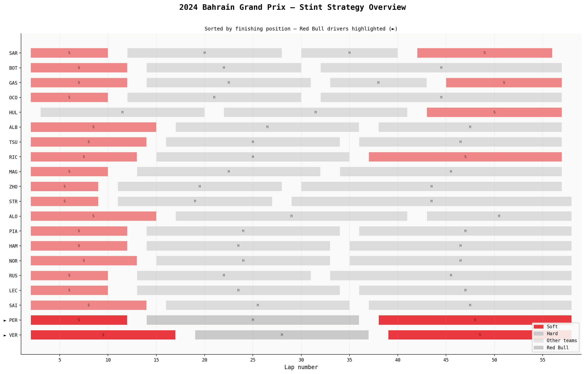
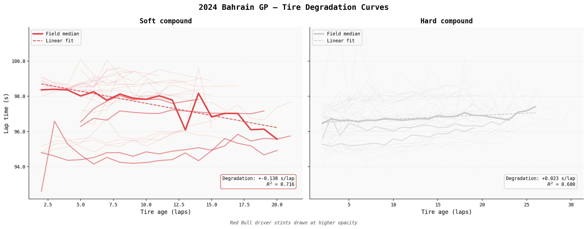
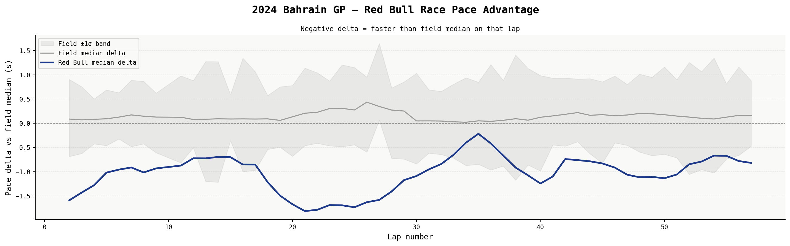
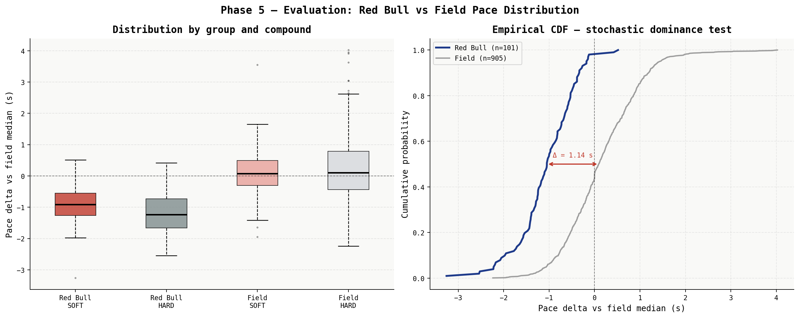

# F1 Pit Stop & Pace Analysis
### 2024 Bahrain Grand Prix — Strategy, Degradation & Statistical Pace Comparison

> *Did Red Bull Racing's strategy produce a statistically significant pace advantage over the rest of the field?*

**Stack:** Python · FastF1 · Pandas · Matplotlib · SciPy
**Methodology:** CRISP-DM
**Data:** FastF1 API — 2024 Bahrain GP Race Session

---

## The Answer

**Yes — with overwhelming statistical confidence.**

A Mann-Whitney U test on 1,006 cleaned race laps returned **p = 2.83 × 10⁻³⁸** and a rank-biserial effect size of **r = 0.781** (large). In **89% of pairwise lap comparisons**, a Red Bull lap was faster than a randomly selected field lap. The mean advantage of **1.224 seconds per lap** accumulated to approximately **70 seconds over the race distance** — not a marginal result, but a structural one.

---

## Project Structure

```
f1_strategy_analysis/
├── data/
│   ├── raw/                    ← FastF1 cached session data
│   └── processed/              ← bahrain_2024_clean.csv
├── notebooks/
│   └── 01_eda.ipynb            ← Exploratory analysis
├── src/
│   ├── data_loader.py          ← FastF1 ingestion
│   ├── data_cleaner.py         ← Cleaning pipeline
│   ├── visualiser.py           ← Figures A, B, C
│   └── evaluator.py            ← Statistical test + Figure D
├── reports/                    ← All output figures + CRISP-DM report
└── requirements.txt
```

---

## Visualisations

### Stint Strategy Gantt
Every driver's pit stop strategy across 57 laps. Bar colour = tire compound. Red Bull drivers highlighted. Sorted by finishing position.



### Tire Degradation Curves
Lap time vs tire age per compound. Individual stint traces at low opacity; field median trend and linear regression fit annotated with slope and R².



### Race Pace Advantage
Rolling-median pace delta (lap time minus field median) for Red Bull vs the field across all 57 laps. Negative = faster than the median field on that lap.



### Statistical Evaluation
Box plots by group and compound alongside empirical CDFs. The Blue (Red Bull) CDF lies entirely to the left of the grey (field) CDF — textbook first-order stochastic dominance. The median gap is 1.14 seconds.



---

## Key Findings

**Strategy:** Red Bull extended their opening Soft stint approximately 4–8 laps longer than the field average. Rejoining in clean air with a longer tire life buffer, they then ran an extended Hard stint before a late Soft charge.

**Degradation:** Hard compound degraded at +0.023 s/lap (R² = 0.600) — gentle and predictable, supporting long stints. The Soft compound showed a negative apparent slope (−0.138 s/lap), which reflects *track evolution* (progressive rubber build-up improving lap times early in the race) rather than compound improvement. Red Bull's extended early Soft stint extracted maximum benefit from this track evolution window.

**Statistical result:**

| Measure | Value |
|---------|-------|
| Mann-Whitney U p-value | 2.83 × 10⁻³⁸ |
| Rank-biserial r | 0.781 (large effect) |
| Probability RB lap faster | 89% |
| Mean pace advantage | 1.224 s/lap |
| Accumulated over race | ~70 seconds |

---

## Reproducing the Analysis

```bash
# 1. Clone and create environment
git clone <repo-url> && cd f1_strategy_analysis
python -m venv .venv && source .venv/bin/activate

# 2. Install dependencies
pip install -r requirements.txt

# 3. Run the full pipeline
python src/data_loader.py    # Downloads and caches session data
python src/data_cleaner.py   # Cleans and engineers features
python src/visualiser.py     # Generates Figures A, B, C
python src/evaluator.py      # Generates Figure D + statistical report
```

FastF1 will cache the session data locally on first run (~50 MB). Subsequent runs use the cache and complete in seconds.

---

## Limitations

- All conclusions are specific to the 2024 Bahrain GP. Track characteristics, weather, and car performance vary across the calendar.
- `PaceDelta` is computed against a full-field median that includes Red Bull's two cars (~10% contamination). The measured advantage is therefore slightly conservative.
- The Soft degradation curve cannot be cleanly separated from track evolution without a fixed-effects model controlling for lap number.
- With only two Red Bull drivers, the Mann-Whitney independence assumption is technically an approximation.

---

## Methodology

This project follows the **CRISP-DM** (Cross-Industry Standard Process for Data Mining) framework across six phases: Business Understanding → Data Understanding → Data Preparation → Modelling → Evaluation → Deployment. The full technical report is at `reports/CRISP_DM_Technical_Report.md`.

---

*Built with FastF1, Pandas, Matplotlib, and SciPy.*